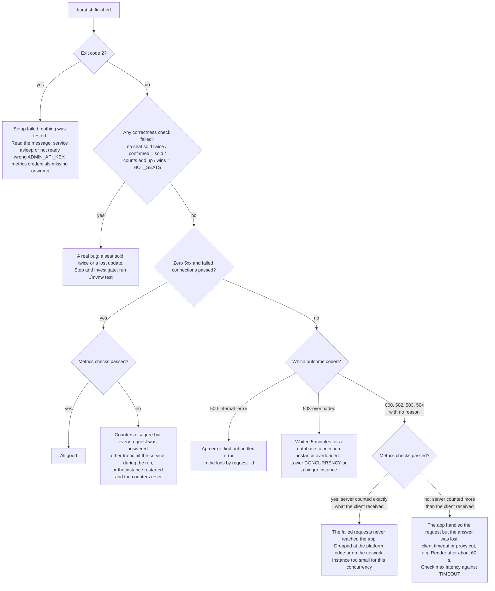

# Seat Selection

A JSON API that sells assigned seats for a show and stays correct under an on-sale stampede: no seat is ever sold twice, no user exceeds their limit, and a retried request never books twice.

- **Live service:** https://paytm-seat-selection.onrender.com (read the cold-start note below first)
- **Design and trade-offs:** [WRITEUP.md](WRITEUP.md)
- **Stack:** Java 21 (virtual threads), Spring Boot 4, Postgres, jOOQ, Flyway

> [!IMPORTANT]
> ## ⏱ Cold start: the live service sleeps when idle
> **The live service runs on Render's free tier. After about 15 minutes without requests, Render shuts the instance down. The next request starts it again, which takes about a minute** (the container boots, the JVM starts, and the app connects to the database). That first request is slow, not broken.
>
> **Wake it up before testing**, and wait until this prints `{"status":"UP",…}`:
> ```bash
> until curl -sf --max-time 120 https://paytm-seat-selection.onrender.com/actuator/health/readiness; do sleep 5; done
> ```
> **The first burst after waking is also slower** while the JVM warms up. Running `burst.sh` twice gives the more representative second result.

## Contents

1. [Run it locally](#run-it-locally)
2. [Use the API](#use-the-api)
3. [The burst script](#the-burst-script)
4. [Tests](#tests)
5. [Metrics and logs](#metrics-and-logs)
6. [Configuration](#configuration)
7. [Deploying to Render](#deploying-to-render)

## Run it locally

### With Docker (the same image that is deployed)

Needs Docker running.

```bash
docker compose up --build
```

- **What starts:** the app on http://localhost:8080 and Postgres 18. The app waits for the database, creates the tables itself on startup, and is ready when this returns `{"status":"UP",…}`:
  ```bash
  curl http://localhost:8080/actuator/health/readiness
  ```
- **If port 5432 is already taken on your machine:** Postgres is only published on it so you can inspect the database. Pick another port:
  ```bash
  DB_HOST_PORT=5434 docker compose up --build
  ```
- **To stop:** `docker compose down`. The database is not kept between runs.

### Without Docker

Needs Java 21 and a Postgres you can reach.

```bash
./mvnw -DskipTests package
DB_HOST=localhost DB_PORT=5432 DB_NAME=seats DATABASE_USERNAME=seats DATABASE_PASSWORD=seats \
  java -jar target/seat_selection-0.0.1-SNAPSHOT.jar
```

## Use the API

All bodies are JSON. Money is in paise (integers). The examples use the local URL; swap in the live URL to try the deployed service.

**1. Create a show** (admin; needs the `X-Admin-Key` header, `dev-admin-key` locally):
```bash
curl -s -X POST http://localhost:8080/shows -H 'X-Admin-Key: dev-admin-key' -H 'Content-Type: application/json' \
  -d '{"name":"friday-night","seats":["A1","A2","A3"],"price_paise":25000,"per_user_limit":4}'
```
`per_user_limit` is optional (default 4). The response includes the show's `id`.

**2. Get a token for a user.** Identity always comes from this token, never from a request body:
```bash
TOKEN=$(curl -s -X POST http://localhost:8080/auth/token -H 'Content-Type: application/json' \
  -d '{"user_id":"alice"}' | jq -r .access_token)
```
This is a demo token issuer: it will issue a token for any user id.

**3. Reserve seats:**
```bash
curl -s -X POST http://localhost:8080/shows/<show-id>/reserve -H "Authorization: Bearer $TOKEN" \
  -H 'Content-Type: application/json' -d '{"seats":["A1"],"idempotency_key":"order-123"}'
```
- **Request options:**
  - `"mode": "hold"` creates a time-boxed hold instead of confirming straight away.
  - The idempotency key can also be sent as an `Idempotency-Key` header.
- **Responses:**

  | Status | Meaning |
  |---|---|
  | `201` | Reserved |
  | `200` + `Idempotent-Replayed: true` | A retry of an earlier request; the original reservation is returned |
  | `409 seat_taken` | A requested seat is already held or sold. Multi-seat requests are all-or-nothing |
  | `409 per_user_limit` | The user would go over the show's limit |
  | `409 idempotency_key_reused` | The same key was used for a different request |
  | `422 unknown_seat` | A seat name doesn't exist in this show |
  | `401` | No or invalid token |
  | `503 overloaded` | No database connection freed up within 5 minutes; safe to retry with the same key |

**4. Everything else:**

| Request | What it does |
|---|---|
| `GET /shows/{id}` | Every seat's status, plus counts (`available + held + confirmed == total`). No token needed |
| `GET /reservations/{id}` | Your own reservation (someone else's returns 404) |
| `POST /reservations/{id}/confirm` | Confirm your own hold before it expires |
| `POST /reservations/{id}/cancel` | Release your own hold or reservation. Cancelling twice is harmless |

## The burst script

`burst.sh` reproduces an on-sale stampede against any running instance, local or live, then checks the results.

```bash
./burst.sh http://localhost:8080
ADMIN_API_KEY=<the service's admin key> ./burst.sh https://paytm-seat-selection.onrender.com
```

- **Needs:** bash, `curl` 7.84 or later, and `jq`.
- **What it does:** creates a fresh 1,000-seat show, then fires one shuffled burst of reserve requests:
  - **Hot-seat storm:** 500 users race for each of 5 seats.
  - **Retries:** 50 requests, each sent 20 times at once with the same key.
  - **Stampede:** 15,000 requests for random seats.
- **During the burst:** it polls the show's counts.
- **Afterwards:** it prints the outcome counts and latency, then 9 PASS/FAIL checks, each with its calculation. For example:
  ```
  [PASS] one winner per hot seat, the rest get 409 seat_taken
         wins = HOT_SEATS                         ->  5 = 5
         seat_taken = HOT_SEATS x (STORM - 1)     ->  2495 = 5 x 499
  ```
- **The checks:**
  - one winner per hot seat
  - one reservation per retried key
  - only clean outcomes
  - no seat sold twice
  - the API's confirmed seats match the 201 responses
  - the counts add up in every snapshot
  - zero 5xx
  - the metrics counters match the responses
  - the seat gauge matches the API
- **Exit code:** `0` if every check passes, `1` if any fails, `2` if setup failed (service not ready, wrong admin key).
- **Settings:** override any of these through environment variables:

  | Variable | Default | What it controls |
  |---|---|---|
  | `ADMIN_API_KEY` | `dev-admin-key` | Must match the service's key |
| `METRICS_USERNAME` / `METRICS_PASSWORD` | `metrics` / (none) | Needed if the service protects `/actuator/prometheus` |
  | `CONCURRENCY` | `300` | Requests in flight at once |
  | `HOT_SEATS` / `STORM` | `5` / `500` | Hot seats, and users racing for each |
  | `RETRY_KEYS` / `RETRY_FANOUT` | `50` / `20` | Retried requests, and copies of each |
  | `STAMPEDE` / `STAMPEDE_USERS` | `15000` / `1500` | Other requests, and the users sending them |
  | `ROWS` / `SEATS_PER_ROW` | `20` / `50` | The hall size |
  | `TIMEOUT` | `330` | Seconds per request; longer than the service's 5-minute wait for a database connection, so the client never gives up first |

- **Against the live free instance,** use a smaller run. It has a fraction of one CPU, so 300 requests at once mostly measures queueing:
  ```bash
  ADMIN_API_KEY=<key> METRICS_USERNAME=<user> METRICS_PASSWORD=<password> \
    CONCURRENCY=50 STORM=50 STAMPEDE=1000 ./burst.sh https://paytm-seat-selection.onrender.com
  ```

### Reading a failed run

A rendered version of this chart, with worked examples from the live service, is in the [Burst Failure Guide](https://claude.ai/artifact/HyqY8FdEjiUbV3jWFU9Vp7).

The checks fall into three groups:
- **Correctness:** no seat sold twice; confirmed seats match the 201s; the counts add up.
- **Scenario counts:** the hot-seat, retry and stampede tallies.
- **Delivery and accounting:** zero 5xx; metrics match the responses.

Which groups fail, together with the `outcomes:` lines, usually tells you what happened:



**Notes**
- **Scenario counts follow from delivery failures.** When requests fail with 5xx or `000`, the hot-seat, retry and stampede tallies come up short by the same number, as long as `wins = HOT_SEATS` still holds. Fix the delivery problem; the scenario logic is fine.
- **"Timed out" invariant snapshots are not failures.** A seat-map poll that didn't answer in time proves nothing either way. Only snapshots whose counts don't add up fail the check.
- **The two halves of the metrics check:**
  - **The metric is higher than the responses:** the app counted something the client never saw.
  - **The metric is lower than the responses:** the counters were reset during the run, usually by a restart.

## Tests

```bash
./mvnw test                                  # all 33 tests; needs Docker running
./mvnw -DexcludedGroups=integration test     # the 9 unit tests only; no Docker needed
```
- **Unit tests:** the request normalisation, the reservation lifecycle rules and the decline codes.
- **Integration tests** (tagged `integration`): run the real app against a real Postgres started with Testcontainers.
  - **Concurrency:** 100 users race for one seat, parallel requests from one user hit the limit, parallel retries share one key, and multi-seat requests overlap in opposite orders.
  - **API rules:** identity from the token, all-or-nothing, holds and expiry, ownership.
  - **Metrics access:** only the configured credentials can read `/actuator/prometheus`.
- **In the image build:** the unit tests run as part of every image build, so a failing rule stops a deploy.

## Metrics and logs

### Metrics

Prometheus format, at `/actuator/prometheus`. On the live service it's protected with HTTP Basic auth (`METRICS_USERNAME` / `METRICS_PASSWORD`), which is how Grafana's scraper reads it; the credentials are shared with reviewers on request. Locally, with no `METRICS_PASSWORD` set, it's open.

| Metric | Meaning |
|---|---|
| `reservations_confirmed_total`, `reservations_held_total` | Reservations created |
| `reservations_declined_total{reason}` | `seat_taken`, `per_user_limit`, `idempotent_replay`, `idempotency_key_reused`, `unknown_seat` |
| `reservations_released_total{reason}` | `cancelled`, `expired` |
| `seats_available` / `seats_held` / `seats_confirmed` / `seats_capacity` `{show_id}` | Per-show seat counts, refreshed every second |
| `reservations_holds_overdue` | Holds more than 10 s past expiry; should always be 0 |
| `hikaricp_connections_active` / `_pending` | Database connections in use / requests waiting for one |
| `process_cpu_usage` | Share of the CPU the app is using (0 to 1) |

**Setup (once per terminal):**
```bash
APP=https://paytm-seat-selection.onrender.com     # or http://localhost:8080
MUSER=<metrics username>; MPASS=<metrics password>  # leave MPASS empty locally

# metrics [PATTERN] -> "name value" lines; with no pattern, all reservation and seat metrics
metrics() {
  local auth=(); [ -n "$MPASS" ] && auth=(-u "$MUSER:$MPASS")
  curl -s "${auth[@]}" "$APP/actuator/prometheus" | grep -E "^(${1:-reservations_|seats_})" | awk '{ v = $2; if (v == int(v)) v = int(v); printf "%-70s %s\n", $1, v }'
}
```

**Getting counts:**
```bash
metrics                                   # everything reservation- and seat-related
metrics reservations_confirmed_total      # confirmations since the app started
metrics reservations_declined_total       # declines, one line per reason
metrics 'seats_.*show_id="<show-id>"'     # available / held / confirmed / capacity for one show
metrics reservations_holds_overdue        # should be 0

# Live view while a burst runs (in a second terminal)
while true; do clear; metrics 'reservations_(confirmed|declined)_total|hikaricp_connections_(active|pending)|process_cpu_usage'; sleep 2; done
```

**Counts over one run:** the `_total` metrics only go up, so take a reading before and after, and subtract. `burst.sh` does this itself and checks the differences against the responses it received.

Counters restart from 0 when the instance restarts, e.g. after the free instance wakes up. The seat gauges are read from the database, so they don't reset.

### Health

- `/actuator/health/liveness`: the app is running.
- `/actuator/health/readiness`: the app can serve, including a live database check. It returns `503` within about 2 seconds if the database is unreachable.

### Logs

Structured JSON, one line per request plus one per reservation decision. Every line carries a `request_id`, which is also returned in the `X-Request-Id` response header and in every error body.

**On Render:** the service's **Logs** tab.

**In Grafana Cloud (Loki),** when `SPRING_PROFILES_ACTIVE=loki` is set. The Grafana stack is private; access is shared on request.
- **In the Grafana UI:** open the stack's Grafana → **Explore** → data source ending in **`-logs`** → set the time range → switch the query editor to **Code** → `{app="seat-selection"}`.
- **From the command line:** Loki's HTTP API takes the same queries. You need a token with **logs:read**, which is different from the **logs:write** token the app uses.

**Setup (once per terminal):**
```bash
U=<stack user number>                       # Grafana Cloud portal -> stack -> Loki -> Details -> User
T=<read token>                              # a token with logs:read
H=https://logs-prod-XXX.grafana.net         # Loki -> Details -> URL (host only)

# loki QUERY [SINCE] [LIMIT] -> matching log lines, newest first
loki() {
  curl -s -u "$U:$T" -G "$H/loki/api/v1/query_range" \
    --data-urlencode "query=$1" --data-urlencode "since=${2:-1h}" --data-urlencode "limit=${3:-20}" |
    jq -r '.data.result[].values[][1]'
}

# loki_count QUERY -> one "group<TAB>count" line per group, for counting queries
loki_count() {
  curl -s -u "$U:$T" -G "$H/loki/api/v1/query" --data-urlencode "query=$1" |
    jq -r '.data.result[] | "\(.metric | to_entries | map(.value) | join(","))\t\(.value[1])"'
}
```

**Finding logs:**
```bash
curl -s -u "$U:$T" "$H/loki/api/v1/label/app/values"                       # which apps are sending logs
loki '{app="seat-selection"}'                                              # the latest 20 lines
loki '{app="seat-selection"} | request_id="<id>"'                          # one request, end to end
loki '{app="seat-selection"} | logger="access" | http_status=~"5.."' 24h   # server errors, last 24 hours
loki '{app="seat-selection"} |= "reserve declined"' 1h 10                  # recent declines
loki '{app="seat-selection"} |= "hold expired"' 24h                        # holds released by the sweeper
```

**Counting:**
```bash
loki_count 'sum by (http_status) (count_over_time({app="seat-selection"} | logger="access" [1h]))'   # requests per status
loki_count 'sum by (reason) (count_over_time({app="seat-selection"} |= "reserve declined" [1h]))'   # declines per reason
```
Right after a burst, the declines-per-reason numbers should match the burst's outcome summary.

Fields such as `logger`, `http_status`, `http_path`, `request_id`, `outcome` and `reason` are attached to each line as metadata, so they can be filtered on directly without `| json`.

## Configuration

Everything is set with environment variables. The defaults suit local development only.

| Variable | Default | Notes |
|---|---|---|
| `JWT_SECRET` | dev value | **Must be set in production:** at least 32 characters (e.g. `openssl rand -base64 48`) |
| `ADMIN_API_KEY` | `dev-admin-key` | **Must be set in production:** protects `POST /shows` |
| `METRICS_USERNAME`, `METRICS_PASSWORD` | `metrics`, (none) | Set a password to require HTTP Basic auth on `/actuator/prometheus` |
| `DB_HOST`, `DB_PORT`, `DB_NAME` | `localhost`, `5432`, `seats` | Or a full JDBC URL in `DATABASE_URL` |
| `DATABASE_USERNAME`, `DATABASE_PASSWORD` | `seats`, `seats` | |
| `DB_POOL_SIZE` | `30` | Keep under your Postgres plan's connection limit |
| `DB_CONNECTION_TIMEOUT_MS` | `300000` | How long a request waits for a database connection before `503 overloaded` |
| `HOLD_TTL` | `120s` | How long a hold lasts |
| `PORT` | `8080` | Set automatically by Render |
| `SPRING_PROFILES_ACTIVE` | (none) | `loki` to also ship logs to Grafana Cloud |
| `LOKI_URL`, `LOKI_USERNAME`, `LOKI_PASSWORD` | (none) | Grafana Cloud Loki push URL (ending `/loki/api/v1/push`), its user id, and a token with **logs:write** |
| `APP_ENV` | `prod` | The `env` label on shipped logs |

For local Docker runs, the Loki values can go in a `.env` file next to `docker-compose.yml`. It is git-ignored.

## Deploying to Render

1. **Create a Postgres database** on Render.
2. **Create a Web Service** from this repository with **Runtime: Docker**. Render builds the `Dockerfile`.
3. **Health check path:** `/actuator/health/readiness`.
4. **Environment variables:**
   - `JWT_SECRET` and `ADMIN_API_KEY`
   - `METRICS_USERNAME` and `METRICS_PASSWORD`, if Grafana will scrape the metrics
   - `DB_HOST`, `DB_NAME`, `DATABASE_USERNAME`, `DATABASE_PASSWORD` from the database's **internal** connection details
   - the Loki variables, if you want logs in Grafana

   Put the database and the web service in the **same region**, and Grafana's Loki stack near them too, or log shipping times out.
5. **Every push** to the connected branch rebuilds and redeploys.
